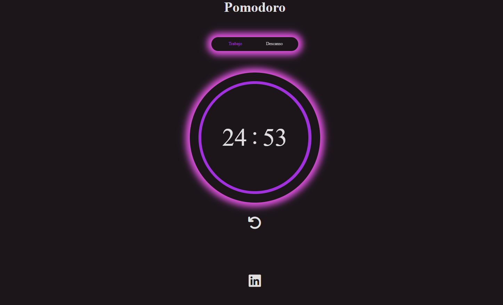

# Idea del proyecto

- La forma de crear ciclos de estudio basado en la tecnica pomodoro
para una mejor efectividad en el aprendizaje.

- Tecnologias implementadas
    - Html
    - Css
    - Script Js

> Screenshot del proyecto...
